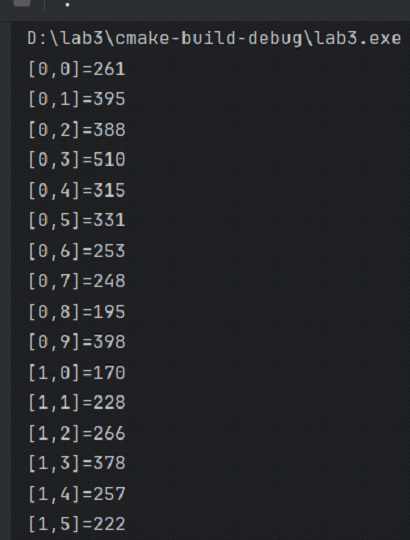
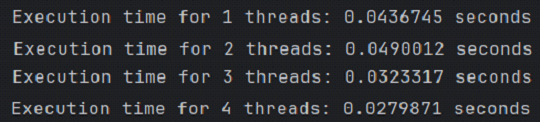
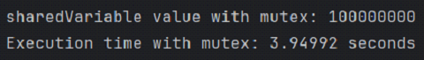
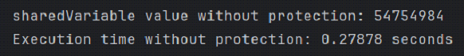
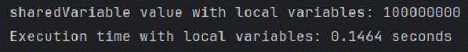
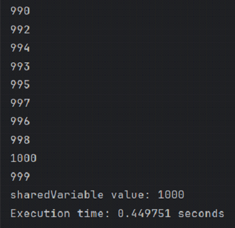

# 🧵 C++ Multithreading & Concurrency Analysis

> A deep-dive analysis of multithreading performance, race conditions, and thread synchronization mechanisms in C++. Created as Lab 4 for the "Operating Systems" course at Taras Shevchenko National University of Kyiv.

---

## 🛠️ Tech Stack & Libraries
- **Language:** C++11 / C++14
- **Concurrency:** `<thread>`, `<mutex>`, `<atomic>`
- **Benchmarking:** `<chrono>`

---

## ⚙️ Core Experiments

### 1. Parallel Matrix Multiplication (`task1.cpp`)
Demonstrates workload distribution across multiple threads. The experiment analyzes execution time against the number of active threads to find the optimal parallelization threshold. For this matrix size, the system peaked at 4 threads, demonstrating that excessive thread creation leads to overhead that slows down execution.

  
  

### 2. The Race Condition vs. Mutex Benchmark (`task2.cpp` & `task3.cpp`)
Compares two threads incrementing a shared variable 50,000,000 times.
- **Without Protection (Race Condition):** Executes blazingly fast but yields an incorrect final value due to simultaneous unmanaged memory access.
- **With `std::mutex`:** Guarantees data accuracy but creates a severe bottleneck due to constant thread locking/unlocking.

  
  

### 3. Atomic Operations & Optimization (`task4.cpp`)
Resolves the mutex performance bottleneck by using local thread variables to accumulate increments, followed by a single `std::atomic::fetch_add` operation. Achieves perfect accuracy with execution times even faster than the unprotected race condition.

### 4. Strict Thread Synchronization (`task5.cpp`)
Forces two asynchronous threads to operate in perfect lockstep. Using modulo arithmetic and atomic loads, the threads strictly alternate turns to increment a shared counter up to 1,000 without skipping or duplicating states.
